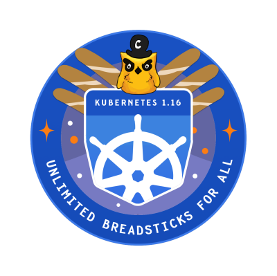

title: You Shall Not Pass!
class: animation-fade
layout: true
footer: Dynamic Admission Controllers in Kubernetes with Webhooks

<!-- This slide will serve as the base layout for all your slides -->
.bottom-bar[
  {{footer}}
]

---

class: middle

# {{title}}
### 
.right[]

<svg xmlns="http://www.w3.org/2000/svg" width="25px" height="25px" viewBox="0 0 480 512"><path d="M186.1 328.7c0 20.9-10.9 55.1-36.7 55.1s-36.7-34.2-36.7-55.1 10.9-55.1 36.7-55.1 36.7 34.2 36.7 55.1zM480 278.2c0 31.9-3.2 65.7-17.5 95-37.9 76.6-142.1 74.8-216.7 74.8-75.8 0-186.2 2.7-225.6-74.8-14.6-29-20.2-63.1-20.2-95 0-41.9 13.9-81.5 41.5-113.6-5.2-15.8-7.7-32.4-7.7-48.8 0-21.5 4.9-32.3 14.6-51.8 45.3 0 74.3 9 108.8 36 29-6.9 58.8-10 88.7-10 27 0 54.2 2.9 80.4 9.2 34-26.7 63-35.2 107.8-35.2 9.8 19.5 14.6 30.3 14.6 51.8 0 16.4-2.6 32.7-7.7 48.2 27.5 32.4 39 72.3 39 114.2zm-64.3 50.5c0-43.9-26.7-82.6-73.5-82.6-18.9 0-37 3.4-56 6-14.9 2.3-29.8 3.2-45.1 3.2-15.2 0-30.1-.9-45.1-3.2-18.7-2.6-37-6-56-6-46.8 0-73.5 38.7-73.5 82.6 0 87.8 80.4 101.3 150.4 101.3h48.2c70.3 0 150.6-13.4 150.6-101.3zm-82.6-55.1c-25.8 0-36.7 34.2-36.7 55.1s10.9 55.1 36.7 55.1 36.7-34.2 36.7-55.1-10.9-55.1-36.7-55.1z"/></svg> @harshanarayana
<svg xmlns="http://www.w3.org/2000/svg" width="25px" height="25px" viewBox="0 0 512 512"><path d="M459.37 151.716c.325 4.548.325 9.097.325 13.645 0 138.72-105.583 298.558-298.558 298.558-59.452 0-114.68-17.219-161.137-47.106 8.447.974 16.568 1.299 25.34 1.299 49.055 0 94.213-16.568 130.274-44.832-46.132-.975-84.792-31.188-98.112-72.772 6.498.974 12.995 1.624 19.818 1.624 9.421 0 18.843-1.3 27.614-3.573-48.081-9.747-84.143-51.98-84.143-102.985v-1.299c13.969 7.797 30.214 12.67 47.431 13.319-28.264-18.843-46.781-51.005-46.781-87.391 0-19.492 5.197-37.36 14.294-52.954 51.655 63.675 129.3 105.258 216.365 109.807-1.624-7.797-2.599-15.918-2.599-24.04 0-57.828 46.782-104.934 104.934-104.934 30.213 0 57.502 12.67 76.67 33.137 23.715-4.548 46.456-13.32 66.599-25.34-7.798 24.366-24.366 44.833-46.132 57.827 21.117-2.273 41.584-8.122 60.426-16.243-14.292 20.791-32.161 39.308-52.628 54.253z"/></svg> @NeerDoseMonster
---

# But first!

It is no more `admissionregistration.k8s.io/v1beta1` but `admissionregistration.k8s.io/v1` starting [v1.16](https://kubernetes.io/blog/2019/09/18/kubernetes-1-16-release-announcement/)

.right[]

---

class: middle

# What Just happened?

```bash
kubectl apply -f deployment.yaml
```

[Sequence Diagram](https://swimlanes.io/u/k0MUv_gsB)

---

class: middle

# Schema

```golang
type ValidatingWebhookConfiguration struct {
	// +optional
	metav1.ObjectMeta `json:"metadata,omitempty" protobuf:"bytes,1,opt,name=metadata"`
	Webhooks []ValidatingWebhook `json:"webhooks,omitempty"`
}
```

---

# ...Schema

```golang
type MutatingWebhook struct {
	Name string `json:"name" protobuf:"bytes,1,opt,name=name"`
	ClientConfig WebhookClientConfig `json:"clientConfig" protobuf:"bytes,2,opt,name=clientConfig"`
	Rules []RuleWithOperations `json:"rules,omitempty" protobuf:"bytes,3,rep,name=rules"`
	// allowed values are Ignore or Fail. Defaults to Fail.
	// +optional
	FailurePolicy *FailurePolicyType `json:"failurePolicy,omitempty"`
	// Allowed values are "Exact" or "Equivalent".
	// Defaults to "Equivalent"
	// +optional
	MatchPolicy *MatchPolicyType `json:"matchPolicy,omitempty" `
	// Default to the empty LabelSelector, which matches everything.
	// +optional
	NamespaceSelector *metav1.LabelSelector `json:"namespaceSelector,omitempty"`
	// Default to the empty LabelSelector, which matches everything.
	// +optional
	ObjectSelector *metav1.LabelSelector `json:"objectSelector,omitempty"`
	// Default to 10 seconds.
	// +optional
	TimeoutSeconds *int32 `json:"timeoutSeconds,omitempty"`
	AdmissionReviewVersions []string `json:"admissionReviewVersions"`
}
```
---

# ClientConfig

```golang
type WebhookClientConfig struct {
	// +optional
	URL *string `json:"url,omitempty" protobuf:"bytes,3,opt,name=url"`
	
	// +optional
	Service *ServiceReference `json:"service,omitempty" protobuf:"bytes,1,opt,name=service"`
	
	// +optional
	CABundle []byte `json:"caBundle,omitempty" protobuf:"bytes,2,opt,name=caBundle"`
}
```

```golang
type ServiceReference struct {
	// Required
	Namespace string `json:"namespace" protobuf:"bytes,1,opt,name=namespace"`
	
	// Required
	Name string `json:"name" protobuf:"bytes,2,opt,name=name"`

	// +optional
	Path *string `json:"path,omitempty" protobuf:"bytes,3,opt,name=path"`

	// +optional
	Port *int32 `json:"port,omitempty" protobuf:"varint,4,opt,name=port"`
}
```
---

# Example

```yaml
apiVersion: admissionregistration.k8s.io/v1beta1
kind: MutatingWebhookConfiguration
metadata:
  name: k8s-demo
webhooks:
  - name: k8s-demo.k8s.io
    clientConfig:
      service:
        name: k8s-demo-hook
        namespace: default
        path: "/mutating"
      caBundle: base64_encoded_ca_bundle_data
    rules:
      - operations:
          - CREATE
          - UPDATE
        apiGroups:
          - "apps"
        apiVersions:
          - "*"
        resources:
          - "deployments"
    failurePolicy: Fail
```
---

class: middle

# Demo

---

class: middle

# The Endgame
